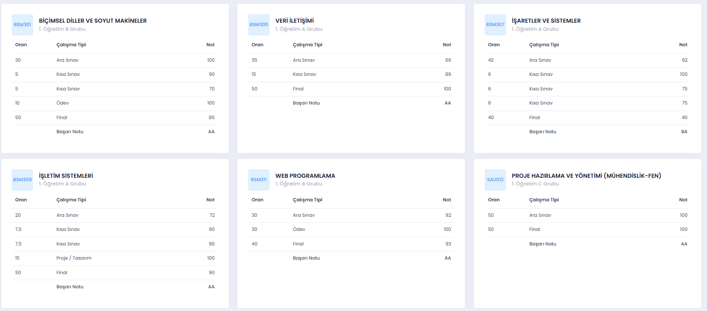
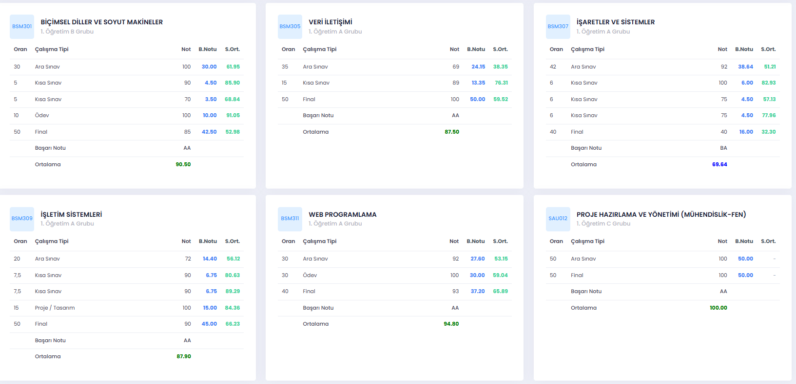
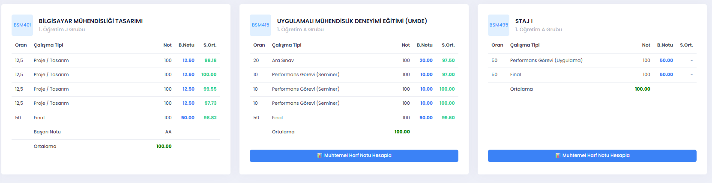
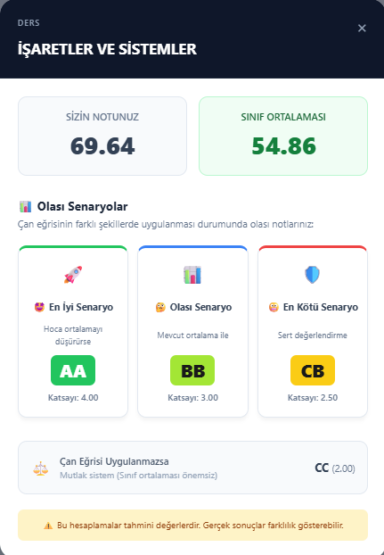
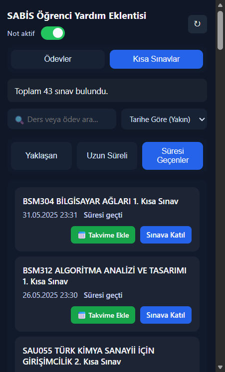
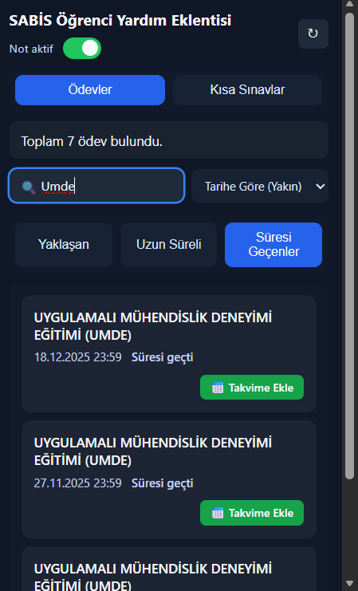
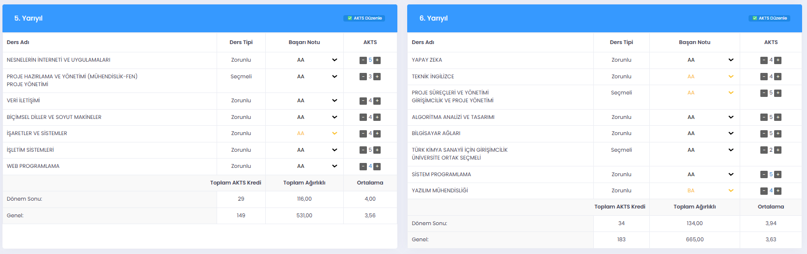
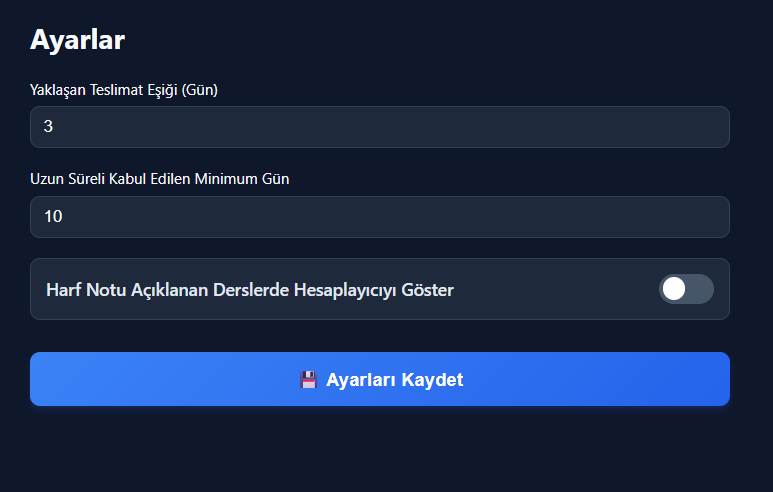

# 🎓 SABİS Öğrenci Asistanı

**SABİS Öğrenci Asistanı**, Sakarya Üniversitesi öğrencilerinin akademik süreçlerini daha verimli yönetmeleri için tasarlanmış kapsamlı bir tarayıcı eklentisidir. Sıradan bir not hesaplayıcıdan öte; **gerçek zamanlı ortalama simülasyonu**, **otomatik akademik takvim takibi** ve **akıllı başarı analizleri** sunan bir üretkenlik aracıdır.

---

## 🔥 Temel Özellikler

### 1. 🖥️ Akıllı Arayüz Entegrasyonu

Eklenti, SABİS'in "Notların Açıklandığı Sayfa" ve "Transkript" sayfalarını otomatik olarak tanır ve arayüze entegre olur. Sayfa yapısını bozmadan, ihtiyacınız olan kritik verileri (Başarı Notu, Sınıf Ortalaması) tablolara ekler.

**Görsel Karşılaştırma:**

| Eklenti Kapalı (Varsayılan) | Eklenti Açık (Zenginleştirilmiş Arayüz) |
| :---: | :---: |
|  |  |

---

### 2. 🧮 Dinamik Not Simülasyonu

Sistem sadece açıklanan notları göstermekle kalmaz, henüz girilmeyen notlar için bir **simülasyon ortamı** yaratır.

*   **✍️ Düzenlenebilir Hücreler:** Not tablosundaki boş kutucuklar, eklenti sayesinde **yazılabilir** alanlara dönüşür.
*   **⚡ Anlık Hesaplama:** Final veya ödev notunuzu tahmini olarak girdiğiniz anda, dersin "B.Notu" (Başarı Notu) ve "Ortalama" değeri milisaniyeler içinde güncellenir.
*   **📊 Sınıf Ortalaması Analizi:** Eklenti arka planda çalışarak, dersin sınıf ortalamasını SABİS sunucularından çeker ve tablodaki "S.Ort." sütununa işler.

  

---

### 3. 🧠 Gelişmiş Senaryo Analizi ve 40 Puan Kuralı

Her ders kartının altında beliren **"Muhtemel Harf Notu Hesapla"** butonu, size derinlemesine bir analiz sunar.

*   **Yönetmelik Uyumu (2025-2026):** Sistem, yeni yönetmeliği otomatik olarak tanır. Eğer **2025 Güz** dönemi ve sonrasındaysanız, finalden 40 puan alma zorunluluğunu kontrol eder. Final notunuz 40'ın altındaysa, ortalamanız ne kadar yüksek olursa olsun sistem sizi uyarır ve **FF/FD** senaryosunu devreye sokar.
*   **Çan Eğrisi Tahminleri:** Sadece standart bir hesaplama yapmaz; hocanın çan eğrisine yapabileceği müdahaleleri (standart sapma değişiklikleri) simüle eder.
    *   **🚀 En İyi Senaryo:** Hocanın ortalamayı düşürdüğü (öğrenci dostu) durum.
    *   **📊 Olası Senaryo:** Mevcut sınıf ortalamasına göre standart dağılım.
    *   **🛡️ En Kötü Senaryo:** Sert değerlendirme veya yüksek ortalama durumu.

*(Aşağıdaki görselde hesaplama penceresinin detaylarını görebilirsiniz)*

  

---

### 4. 📅 Akademik Takvim ve Görev Yönetimi

Tarayıcı ikonuna tıkladığınızda açılan menü, tüm akademik takviminizi avucunuzun içine getirir.

*   **İki Ayrı Sekme:** **"Ödevler"** ve **"Kısa Sınavlar"** sekmeleri sayesinde karışıklık yaşamazsınız.
*   **Google Takvim Entegrasyonu:** Her kartın üzerindeki yeşil butona tek tıkla, o sınavı veya ödevi takviminize işleyebilirsiniz. (Gününde takvime ekler; *hatırlatıcı süresini Google Takvim varsayılan ayarlarınız belirler, ödevler için manuel olarak 1 gün seçmeniz önerilir.*)
*   **Akıllı Arama ve Sıralama:** Yüzlerce ders arasından istediğinizi anında bulabilir, yaklaşan teslim tarihlerine veya ders ismine göre sıralama yapabilirsiniz.

<table align="center" style="border: none;">
  <tr>
    <td align="center" style="border: none;"><strong>Ana Menü ve Sekmeler</strong></td>
    <td align="center" style="border: none;"><strong>Filtreleme ve Sıralama</strong></td>
  </tr>
  <tr>
    <td align="center" style="border: none;"></td>
    <td align="center" style="border: none;"></td>
  </tr>
</table>

---

### 5. 📝 Transkript ve AKTS Planlama

Transkript sayfasında "AKTS Düzenle" modu devreye girer. Henüz açıklanmamış harf notlarını tahmini olarak girerek, dönem sonu Genel Not Ortalamanızı (GNO) şimdiden görebilirsiniz.

  

---

### 6. ⚙️ Kişiselleştirilebilir Ayarlar

Eklentinin "Ayarlar" sayfasından, "Ödev Takipçisi"nin nasıl davranacağını kendi çalışma düzeninize göre özelleştirebilirsiniz.

*   **Yaklaşan Teslim Süresi:** Bir ödevin "Yaklaşanlar" listesine girmesi için kaç gün kalması gerektiğini belirleyin (Örn: Son 3 gün).
*   **Uzun Vadeli Süre:** Teslimine çok zaman olan ödevlerin "Uzun Vadeli" kategorisinde görünmesi için alt limiti seçin (Örn: 10 gün ve üzeri).
*   **Hesaplayıcı Görünürlüğü (Switch):** "Notu açıklanan derslerde hesaplayıcıyı göster" seçeneğini aktif ederseniz, harf notunuz belli olmuş olsa bile (örneğin kontrol amaçlı veya senaryo denemek için) not hesaplama butonları görünür kalmaya devam eder.

  

---

## 🚀 Kurulum

1.  Bu projeyi bilgisayarınıza indirin (ZIP olarak veya git ile).
2.  Chrome adres çubuğuna `chrome://extensions` yazın.
3.  Sağ üst köşedeki **"Geliştirici modu"** anahtarını açın.
4.  **"Paketlenmemiş öğe yükle"** butonuna tıklayın ve indirdiğiniz proje klasörünü seçin.

---

## 📧 İletişim ve Destek

Bu proje Sakarya Üniversitesi öğrencileri tarafından, öğrenci topluluğuna katkı sağlamak amacıyla geliştirilmiştir.

*   **Süleyman Samet Kaya** - suleymansametkaya@gmail.com
*   **Osman Tahir Özdemir** - ozdemirosmantahir@gmail.com
